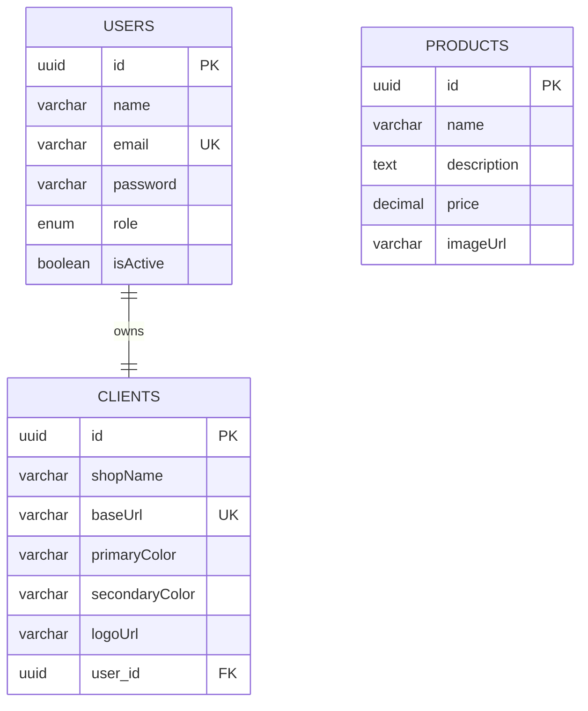

# E-Commerce Whitelabel - Teste Técnico 2025

Este projeto é uma solução completa de E-Commerce Whitelabel, composta por uma API robusta em NestJS e um Frontend moderno em Flutter Web. O sistema permite que múltiplos clientes tenham suas próprias lojas personalizadas (cores, logos, banners) operando sobre a mesma infraestrutura, diferenciadas pela URL de acesso.


## 🚀 Como Rodar o Projeto

### Pré-requisitos

Antes de começar, certifique-se de ter instalado em sua máquina:
- **Git**: Para clonar o repositório.
- **Node.js** (v18+): Para executar a API.
- **Flutter** (v3.x): Para executar o Frontend.
- **PostgreSQL** (ou MySQL): Banco de dados relacional.

### 1. Clonando o Repositório

Abra seu terminal e clone o projeto:

```bash
git clone https://github.com/luiz-hms/testeTecnicoin8.git
cd seu-repositorio
```

---

### 2. Configurando o Banco de Dados

O projeto utiliza **TypeORM** com a opção `synchronize: true`, o que significa que **não é necessário rodar migrations manualmente**. O sistema criará as tabelas automaticamente ao iniciar.

No entanto, você precisa **criar o banco de dados** manualmente no seu SGBD.

**Passo a passo (PostgreSQL):**

1. Acesse seu PostgreSQL (via terminal ou pgAdmin).
2. Crie um banco de dados chamado `ecommerce_db` (ou outro nome de sua preferência):
   ```sql
   CREATE DATABASE ecommerce_db;
   ```
3. Certifique-se de que o serviço do banco de dados está rodando.

### Criação das Tabelas (Automática vs Manual)

O projeto está configurado com `synchronize: true` no TypeORM, o que cria as tabelas automaticamente ao rodar o projeto.

**Caso precise criar manualmente (SQL):**

```sql
-- 1. Tabela de Usuários
CREATE TABLE "users" (
    "id" uuid NOT NULL DEFAULT uuid_generate_v4(),
    "name" character varying NOT NULL,
    "email" character varying NOT NULL,
    "password" character varying NOT NULL,
    "role" character varying NOT NULL DEFAULT 'admin',
    "isActive" boolean NOT NULL DEFAULT true,
    "createdAt" TIMESTAMP NOT NULL DEFAULT now(),
    "updatedAt" TIMESTAMP NOT NULL DEFAULT now(),
    CONSTRAINT "PK_users" PRIMARY KEY ("id"),
    CONSTRAINT "UQ_users_email" UNIQUE ("email")
);

-- 2. Tabela de Clientes (Lojas Whitelabel)
CREATE TABLE "clients" (
    "id" uuid NOT NULL DEFAULT uuid_generate_v4(),
    "shopName" character varying NOT NULL,
    "baseUrl" character varying NOT NULL,
    "primaryColor" character varying NOT NULL DEFAULT '#007BFF',
    "secondaryColor" character varying NOT NULL DEFAULT '#6C757D',
    "logoUrl" character varying,
    "logoPath" character varying,
    "bannerImage1Url" character varying,
    "bannerImage1Path" character varying,
    "bannerImage2Url" character varying,
    "bannerImage2Path" character varying,
    "bannerImage3Url" character varying,
    "bannerImage3Path" character varying,
    "user_id" uuid,
    "createdAt" TIMESTAMP NOT NULL DEFAULT now(),
    "updatedAt" TIMESTAMP NOT NULL DEFAULT now(),
    CONSTRAINT "PK_clients" PRIMARY KEY ("id"),
    CONSTRAINT "UQ_clients_baseUrl" UNIQUE ("baseUrl"),
    CONSTRAINT "FK_clients_user" FOREIGN KEY ("user_id") REFERENCES "users"("id") ON DELETE NO ACTION ON UPDATE NO ACTION
);

-- 3. Tabela de Produtos (Cache/Sync)
CREATE TABLE "products" (
    "id" uuid NOT NULL DEFAULT uuid_generate_v4(),
    "externalId" character varying NOT NULL,
    "name" character varying NOT NULL,
    "description" text NOT NULL,
    "price" decimal NOT NULL,
    "imageUrl" character varying NOT NULL,
    "provider" character varying NOT NULL,
    "createdAt" TIMESTAMP NOT NULL DEFAULT now(),
    "updatedAt" TIMESTAMP NOT NULL DEFAULT now(),
    CONSTRAINT "PK_products" PRIMARY KEY ("id")
);
```

### 3. Executando a API (Backend)

1. Navegue até a pasta da API:
   ```bash
   cd api
   ```

2. Instale as dependências:
   ```bash
   npm install
   ```

3. Configure as variáveis de ambiente:
   - Crie um arquivo `.env` na raiz da pasta `api`.
   - Copie o conteúdo abaixo e ajuste conforme suas credenciais do banco:

   ```env
   # Configuração do Banco de Dados
   DB_HOST=localhost
   DB_PORT=5432
   DB_USERNAME=postgres
   DB_PASSWORD=sua_senha_aqui
   DB_NAME=ecommerce_db

   # Segurança
   JWT_SECRET=sua_chave_secreta_super_segura
   JWT_EXPIRES_IN=7d
   JWT_REFRESH_EXPIRES_IN=30d
   BCRYPT_SALT_ROUNDS=10
   ```

4. Execute a API em modo de desenvolvimento:
   ```bash
   npm run start:dev
   ```

   ✅ **Sucesso**: Você verá logs indicando que a aplicação está rodando em `http://localhost:3000`.

---

### 4. Executando o Frontend (Flutter Web)

1. Abra um novo terminal e navegue até a pasta do frontend:
   ```bash
   cd ecommercefrontend
   ```

2. Instale as dependências do Flutter:
   ```bash
   flutter pub get
   ```

3. Execute o projeto Web:
   > **Importante**: Usamos a porta `8000` para garantir compatibilidade com o sistema de whitelabel local.

   ```bash
   flutter run -d chrome --web-port 8000
   ```

   ✅ **Sucesso**: O Chrome abrirá automaticamente em `http://localhost:8000`.

---

## 🧪 Testando o Whitelabel (Passo a Passo)

O sistema diferencia as lojas pelo subdomínio ou hostname. Para testar localmente sem configurar DNS complexo, usamos o sufixo `.localhost`.

1. **Crie uma Loja**:
   - Acesse o Frontend (`http://localhost:8000`).
   - Vá em "Registrar".
   - Preencha os dados e no campo "Nome da Loja", coloque **"Devnology"**.
   - O sistema criará a loja com a URL base `devnology`.

2. **Acesse a Loja Criada**:
   - No navegador, digite: `http://devnology.localhost:8000`
   - O sistema detectará a loja "Devnology".

3. **Personalize**:
   - Faça login na loja `devnology.localhost:8000`.
   - Vá em **Configurações** (ícone de engrenagem ou menu).
   - Mude a **Cor Primária** para Verde e salve.
   - A barra superior mudará de cor instantaneamente.

4. **Teste Outra Loja**:
   - Registre outra loja chamada **"In8"**.
   - Acesse `http://in8.localhost:8000`.
   - Note que ela terá as cores padrão (Azul), totalmente independente da loja Devnology.

---

## 📖 Documentação da API (Swagger)

A API possui documentação interativa (Swagger UI).

- **Acesso**: `http://localhost:3000/api`

### Como usar:
1. **Authorize**: Clique no botão "Authorize" no topo.
2. **Login**: Use o endpoint `/auth/login` para obter um `access_token`.
3. **Cole o Token**: Cole o token no campo de autorização (formato: `Bearer <seu_token>`).
4. **Testar**: Agora você pode testar endpoints protegidos como `/users/me` ou `/clients/settings`.

---

## 🏗️ Arquitetura e Tecnologias

### Backend (NestJS)
- **Clean Architecture & DDD**: Separação clara entre Domínio, Aplicação e Infraestrutura.
- **TypeORM**: ORM para comunicação com o banco de dados.
- **Passport & JWT**: Estratégias de autenticação robustas.
- **Automapper**: Mapeamento eficiente entre Entidades e DTOs.

### Frontend (Flutter)
- **Clean Architecture**: Camadas de Domain, Data e Presentation.
- **Cubit (Bloc)**: Gerenciamento de estado previsível e testável.
- **Dio**: Cliente HTTP poderoso com Interceptors para Refresh Token automático.
- **GetIt**: Injeção de dependência para desacoplamento.
- **GoRouter**: Gerenciamento de rotas declarativo.

---

## 🔒 Detalhes de Segurança

- **Frontend**:
  - Tokens salvos em **Secure Storage** (Keychain no iOS, Keystore no Android, Criptografia AES na Web).
  - **Refresh Token Automático**: O usuário não é deslogado quando o token expira; o sistema renova silenciosamente.

- **Backend**:
  - **Hashing**: Senhas nunca são salvas em texto plano (Bcrypt).
  - **Validação**: Todos os dados de entrada são validados com `class-validator` para prevenir injeção e dados inválidos.

---

## 🗄️ Modelo de Dados (DER)


