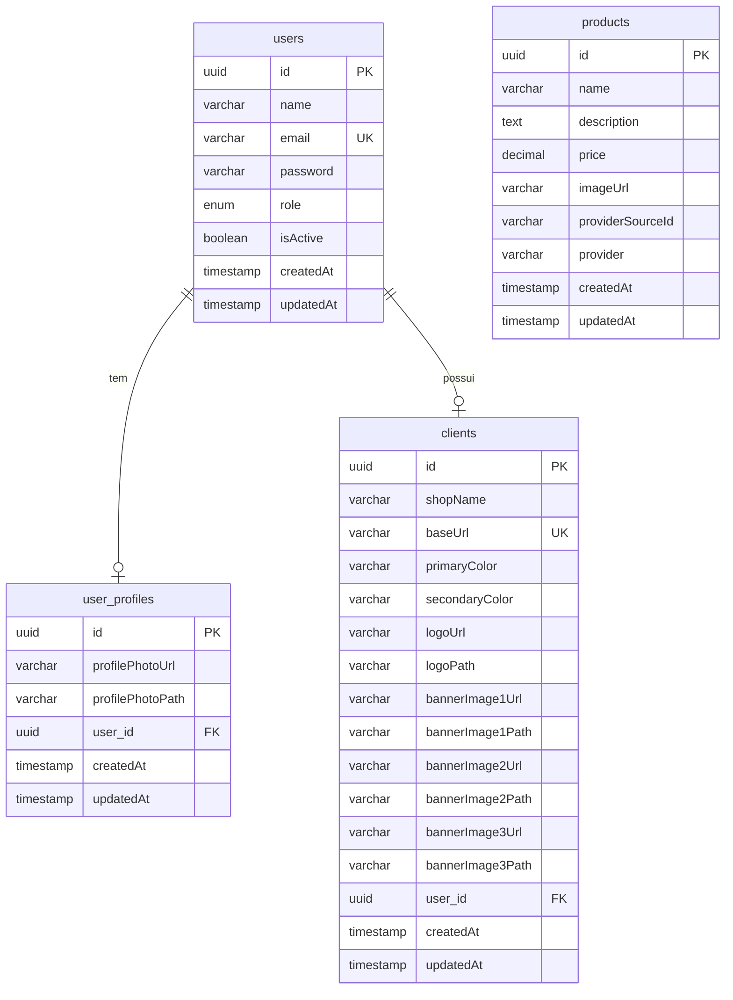

# 📊 DER - Diagrama Entidade-Relacionamento

## Banco de Dados: iaia_db

### Entidades e Relacionamentos



## Descrição das Tabelas

### 1. **users** (Usuários)
Armazena os dados de autenticação e informações básicas dos usuários.

| Campo | Tipo | Descrição | Restrições |
|-------|------|-----------|------------|
| id | UUID | Identificador único | PK, Auto-gerado |
| name | VARCHAR(255) | Nome completo do usuário | NOT NULL |
| email | VARCHAR(255) | Email do usuário | UNIQUE, NOT NULL |
| password | VARCHAR(255) | Senha hash (bcrypt) | NOT NULL |
| role | ENUM | Papel do usuário (ADMIN) | Default: ADMIN |
| isActive | BOOLEAN | Status de ativação | Default: true |
| createdAt | TIMESTAMP | Data de criação | Auto |
| updatedAt | TIMESTAMP | Data de atualização | Auto |

**Relacionamentos:**
- 1:1 com `user_profiles`
- 1:1 com `clients`

---

### 2. **user_profiles** (Perfis de Usuário)
Armazena informações adicionais do perfil do usuário.

| Campo | Tipo | Descrição | Restrições |
|-------|------|-----------|------------|
| id | UUID | Identificador único | PK, Auto-gerado |
| profilePhotoUrl | VARCHAR(500) | URL da foto de perfil | NULLABLE |
| profilePhotoPath | VARCHAR(500) | Caminho local da foto | NULLABLE |
| user_id | UUID | Ref. ao usuário | FK → users.id |
| createdAt | TIMESTAMP | Data de criação | Auto |
| updatedAt | TIMESTAMP | Data de atualização | Auto |

**Relacionamentos:**
- N:1 com `users` (CASCADE on DELETE)

---

### 3. **clients** (Lojas/Clientes Whitelabel)
Armazena as configurações de cada loja whitelabel.

| Campo | Tipo | Descrição | Restrições |
|-------|------|-----------|------------|
| id | UUID | Identificador único | PK, Auto-gerado |
| shopName | VARCHAR(255) | Nome da loja | NOT NULL |
| baseUrl | VARCHAR(255) | URL única da loja | UNIQUE, NOT NULL |
| primaryColor | VARCHAR(7) | Cor primária (hex) | Default: #007BFF |
| secondaryColor | VARCHAR(7) | Cor secundária (hex) | Default: #6C757D |
| logoUrl | VARCHAR(500) | URL pública do logo | NULLABLE |
| logoPath | VARCHAR(500) | Caminho local do logo | NULLABLE |
| bannerImage1Url | VARCHAR(500) | URL do banner 1 | NULLABLE |
| bannerImage1Path | VARCHAR(500) | Caminho do banner 1 | NULLABLE |
| bannerImage2Url | VARCHAR(500) | URL do banner 2 | NULLABLE |
| bannerImage2Path | VARCHAR(500) | Caminho do banner 2 | NULLABLE |
| bannerImage3Url | VARCHAR(500) | URL do banner 3 | NULLABLE |
| bannerImage3Path | VARCHAR(500) | Caminho do banner 3 | NULLABLE |
| user_id | UUID | Ref. ao proprietário | FK → users.id |
| createdAt | TIMESTAMP | Data de criação | Auto |
| updatedAt | TIMESTAMP | Data de atualização | Auto |

**Relacionamentos:**
- N:1 com `users`

**Índices:**
- UNIQUE em `baseUrl` (para identificação whitelabel)

---

### 4. **products** (Produtos)
Armazena os produtos sincronizados dos fornecedores.

| Campo | Tipo | Descrição | Restrições |
|-------|------|-----------|------------|
| id | UUID | Identificador único | PK, Auto-gerado |
| name | VARCHAR(255) | Nome do produto | NOT NULL |
| description | TEXT | Descrição do produto | NOT NULL |
| price | DECIMAL(10,2) | Preço do produto | NOT NULL |
| imageUrl | VARCHAR(500) | URL da imagem | NOT NULL |
| providerSourceId | VARCHAR(255) | ID no fornecedor | NOT NULL |
| provider | VARCHAR(50) | Fornecedor origem | NOT NULL |
| createdAt | TIMESTAMP | Data de criação | Auto |
| updatedAt | TIMESTAMP | Data de atualização | Auto |

**Valores de `provider`:**
- `brazilian_provider`
- `european_provider`

**Índices:**
- Composto em `(provider, providerSourceId)` para evitar duplicatas

---

## Relacionamentos Detalhados

### 1. users → user_profiles (1:1)
- **Tipo:** One-to-One
- **Cardinalidade:** Um usuário tem no máximo um perfil
- **Cascade:** DELETE CASCADE (ao excluir usuário, exclui perfil)
- **FK:** `user_profiles.user_id` → `users.id`

### 2. users → clients (1:1)
- **Tipo:** One-to-One
- **Cardinalidade:** Um usuário possui uma loja
- **FK:** `clients.user_id` → `users.id`

### 3. products (Independente)
- **Tipo:** Standalone
- **Nota:** Produtos são compartilhados entre todas as lojas

---

## Modelo de Dados - Representação Visual

```
┌─────────────────┐         ┌──────────────────┐
│     users       │◄───1:1──│  user_profiles   │
│                 │         │                  │
│ • id (PK)       │         │ • id (PK)        │
│ • name          │         │ • user_id (FK)   │
│ • email (UK)    │         │ • photoUrl       │
│ • password      │         │ • photoPath      │
│ • role          │         └──────────────────┘
│ • isActive      │
└────────┬────────┘
         │
         │ 1:1
         │
         ▼
┌─────────────────┐
│    clients      │
│                 │
│ • id (PK)       │
│ • shopName      │
│ • baseUrl (UK)  │
│ • colors        │
│ • logo          │
│ • banners       │
│ • user_id (FK)  │
└─────────────────┘

┌─────────────────┐
│   products      │ (Independente)
│                 │
│ • id (PK)       │
│ • name          │
│ • description   │
│ • price         │
│ • imageUrl      │
│ • provider      │
└─────────────────┘
```

---

## Regras de Negócio

### Autenticação
- Senhas armazenadas com hash bcrypt (salt rounds: 10)
- Email deve ser único no sistema
- Todos os usuários possuem role ADMIN por padrão

### Whitelabel
- Cada usuário possui UMA loja (`clients`)
- `baseUrl` é gerada automaticamente a partir do `shopName`
- `baseUrl` deve ser única no sistema
- Cores em formato hexadecimal (#RRGGBB)
- Suporta 1 logo + até 3 banners por loja

### Produtos
- Produtos são sincronizados de dois fornecedores
- Campo `provider` identifica a origem
- `providerSourceId` mantém referência ao ID original
- Produtos são compartilhados entre todas as lojas

---

## Índices e Performance

### Índices Automáticos (PKs)
- `users.id`
- `user_profiles.id`
- `clients.id`
- `products.id`

### Índices Únicos
- `users.email` (UNIQUE)
- `clients.baseUrl` (UNIQUE)

### Índices Recomendados
- `products(provider, providerSourceId)` - Para busca de produtos por fornecedor
- `clients(user_id)` - Para busca de loja por usuário

---

## Tecnologias Utilizadas

- **ORM:** TypeORM 0.3.27
- **Banco de Dados:** PostgreSQL
- **Migrations:** TypeORM CLI
- **Sincronização:** Auto-sync habilitado em desenvolvimento

---

## Scripts SQL de Criação

### Criar Banco de Dados
```sql
CREATE DATABASE iaia_db;
```

### As tabelas são criadas automaticamente pelo TypeORM
O TypeORM gerencia a criação e atualização das tabelas baseado nas entidades definidas.

---

**Versão:** 1.0  
**Data:** 24/11/2025  
**Responsável:** Documentação Técnica
