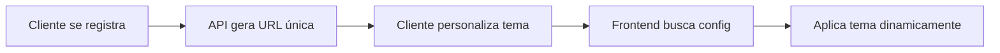

# 🏪 E-commerce Whitelabel API

API NestJS para plataforma de e-commerce whitelabel com suporte a múltiplas lojas, autenticação JWT, e personalização completa de tema e identidade visual.

## 🚀 Recursos

- ✅ **Sistema Whitelabel Completo** - URLs únicas para cada loja
- ✅ **Autenticação JWT** - Login, registro e refresh token
- ✅ **Personalização de Tema** - Cores primária/secundária personalizáveis
- ✅ **Upload de Imagens** - Logo e até 3 banners por loja
- ✅ **Gestão de Produtos** - Integração com provedores externos
- ✅ **Domain-Driven Design** - Arquitetura limpa e escalável
- ✅ **TypeORM** - Persistência de dados com PostgreSQL
- ✅ **Swagger** - Documentação automática da API

## 📋 Pré-requisitos

- Node.js 16+
- PostgreSQL
- npm ou yarn

## ⚙️ Instalação

```bash
# Clonar o repositório
git clone <seu-repositorio>
cd iaia

# Instalar dependências
npm install

# Configurar variáveis de ambiente
cp .env.example .env
# Edite o arquivo .env com suas configurações

# Executar migrations
npm run typeorm migration:run

# Iniciar em modo desenvolvimento
npm run start:dev
```

## 🔧 Configuração do .env

```env
# Database
DB_HOST=localhost
DB_PORT=5432
DB_USERNAME=postgres
DB_PASSWORD=sua_senha
DB_DATABASE=iaia_db

# JWT
JWT_SECRET=seu_secret_super_seguro
JWT_EXPIRES_IN=7d

# Server
PORT=3000
NODE_ENV=development

# External Providers
BRAZILIAN_PROVIDER_URL=https://api.escuelajs.co/api/v1/products
EUROPEAN_PROVIDER_URL=https://api.escuelajs.co/api/v1/products

# Whitelabel
BASE_DOMAIN=localhost
```

## 🎨 Sistema Whitelabel

### Como Funciona

1. **Registro de Loja**: Ao criar um usuário, uma URL única é gerada automaticamente
2. **Personalização**: Configure cores, logo e banners via API
3. **Acesso Público**: Endpoint público retorna configurações pela URL

### Fluxo de Uso



### Exemplo de Registro

```bash
POST /auth/register
Content-Type: application/json

{
  "name": "João Silva",
  "email": "joao@loja1.com",
  "password": "senha123",
  "shopName": "Loja1"
}
```

**Resposta:**
```json
{
  "access_token": "eyJhbGc...",
  "user": { ... },
  "client": {
    "id": "uuid",
    "shopName": "Loja1",
    "baseUrl": "http://loja1.local:3000"
  }
}
```

### Personalizar Cores

```bash
PUT /clients/{clientId}/settings
Authorization: Bearer {token}
Content-Type: application/json

{
  "primaryColor": "#8B5CF6",    // Roxo
  "secondaryColor": "#10B981"   // Verde
}
```

### Buscar Configurações (Público)

```bash
GET /auth/whitelabel/http%3A%2F%2Floja1.local%3A3000
```

**Resposta:**
```json
{
  "id": "uuid",
  "shopName": "Loja1",
  "baseUrl": "http://loja1.local:3000",
  "primaryColor": "#8B5CF6",
  "secondaryColor": "#10B981",
  "logo": {
    "url": "/uploads/logos/logo-123.png"
  },
  "bannerImages": [
    { "url": "/uploads/banners/banner-1.png" },
    { "url": "/uploads/banners/banner-2.png" }
  ]
}
```

## 📱 Integração com Flutter Web

### Instalação de Dependências

```yaml
dependencies:
  flutter:
    sdk: flutter
  http: ^1.1.0
  provider: ^6.1.0
```

### Serviço Whitelabel

```dart
import 'dart:html' as html;
import 'package:http/http.dart' as http;

class WhitelabelService {
  static const String API_BASE_URL = 'http://localhost:3000';

  static String getCurrentUrl() {
    return html.window.location.origin;
  }

  static Future<WhitelabelConfig> fetchStoreConfig() async {
    final currentUrl = getCurrentUrl();
    final encodedUrl = Uri.encodeComponent(currentUrl);
    
    final response = await http.get(
      Uri.parse('$API_BASE_URL/auth/whitelabel/$encodedUrl'),
    );

    if (response.statusCode == 200) {
      return WhitelabelConfig.fromJson(json.decode(response.body));
    }
    throw Exception('Loja não encontrada');
  }

  static Color hexToColor(String hex) {
    hex = hex.replaceAll('#', '');
    if (hex.length == 6) hex = 'FF$hex';
    return Color(int.parse(hex, radix: 16));
  }
}
```

### Provider de Tema

```dart
class ThemeProvider extends ChangeNotifier {
  WhitelabelConfig? _config;

  ThemeData get themeData {
    if (_config == null) return ThemeData.light();

    return ThemeData(
      primaryColor: WhitelabelService.hexToColor(_config!.primaryColor),
      colorScheme: ColorScheme.fromSeed(
        seedColor: WhitelabelService.hexToColor(_config!.primaryColor),
        secondary: WhitelabelService.hexToColor(_config!.secondaryColor),
      ),
    );
  }

  Future<void> loadStoreConfig() async {
    _config = await WhitelabelService.fetchStoreConfig();
    notifyListeners();
  }
}
```

### App Principal

```dart
void main() {
  runApp(
    ChangeNotifierProvider(
      create: (_) => ThemeProvider()..loadStoreConfig(),
      child: const MyApp(),
    ),
  );
}

class MyApp extends StatelessWidget {
  @override
  Widget build(BuildContext context) {
    return Consumer<ThemeProvider>(
      builder: (context, themeProvider, child) {
        return MaterialApp(
          theme: themeProvider.themeData,
          home: HomePage(),
        );
      },
    );
  }
}
```

## 🧪 Testando Localmente

### 1. Configurar Hosts

**Windows (como Administrador):**
```
C:\Windows\System32\drivers\etc\hosts
127.0.0.1 loja1.local
127.0.0.1 loja2.local
```

**Linux/Mac:**
```bash
sudo nano /etc/hosts
# Adicione:
127.0.0.1 loja1.local
127.0.0.1 loja2.local
```

### 2. Criar Lojas de Teste

```bash
# Loja 1 (Roxo e Verde)
curl -X POST http://localhost:3000/auth/register \
  -H "Content-Type: application/json" \
  -d '{
    "name": "João",
    "email": "joao@loja1.com",
    "password": "senha123",
    "shopName": "Loja1"
  }'

# Loja 2 (Vermelho e Dourado)
curl -X POST http://localhost:3000/auth/register \
  -H "Content-Type: application/json" \
  -d '{
    "name": "Maria",
    "email": "maria@loja2.com",
    "password": "senha123",
    "shopName": "Loja2"
  }'
```

### 3. Personalizar Cores

```bash
curl -X PUT http://localhost:3000/clients/{clientId}/settings \
  -H "Authorization: Bearer {token}" \
  -H "Content-Type: application/json" \
  -d '{
    "primaryColor": "#8B5CF6",
    "secondaryColor": "#10B981"
  }'
```

### 4. Testar no Flutter

```bash
flutter run -d chrome
# Acesse: http://loja1.local:porta_do_flutter
```

## 📚 Estrutura do Projeto

```
src/
├── domains/              # Domain-Driven Design
│   ├── auth/            # Autenticação e whitelabel
│   ├── client/          # Gestão de lojas/clientes
│   ├── product/         # Gestão de produtos
│   └── user/            # Gestão de usuários
├── infrastructure/      # Infraestrutura
│   ├── config/          # Configurações e DNS Manager
│   ├── database/        # TypeORM setup
│   ├── file-storage/    # Upload de arquivos
│   └── http/            # HTTP Client
├── common/              # Recursos compartilhados
│   ├── controllers/     # Controllers comuns
│   ├── decorators/      # Decorators customizados
│   └── pipes/           # Pipes de validação
└── main.ts              # Entry point
```

## 🔐 Endpoints Principais

### Autenticação

| Método | Endpoint | Descrição | Auth |
|--------|----------|-----------|------|
| POST | `/auth/register` | Registrar usuário e loja | Não |
| POST | `/auth/login` | Fazer login | Não |
| POST | `/auth/refresh-token` | Renovar token | Não |
| GET | `/auth/whitelabel/:baseUrl` | Buscar config da loja | Não |

### Clientes/Lojas

| Método | Endpoint | Descrição | Auth |
|--------|----------|-----------|------|
| GET | `/clients/:id` | Obter configurações | Sim |
| PUT | `/clients/:id/settings` | Atualizar configurações | Sim |
| POST | `/clients/:id/logo` | Upload de logo | Sim |
| POST | `/clients/:id/banner-images` | Upload de banners | Sim |

### Produtos

| Método | Endpoint | Descrição | Auth |
|--------|----------|-----------|------|
| GET | `/products` | Listar produtos | Não |
| GET | `/products/:id` | Obter produto | Não |

### Usuários

| Método | Endpoint | Descrição | Auth |
|--------|----------|-----------|------|
| GET | `/users/profile` | Obter perfil | Sim |
| PUT | `/users/profile` | Atualizar perfil | Sim |
| POST | `/users/profile/photo` | Upload de foto | Sim |

## 📖 Documentação da API

Acesse a documentação Swagger em desenvolvimento:

```
http://localhost:3000/api
```

## 🚀 Deploy em Produção

### Configuração DNS Wildcard

Para permitir subdomínios dinâmicos (ex: `loja1.seudominio.com`):

**Cloudflare:**
```
Tipo: A
Nome: *
Conteúdo: IP_DO_SERVIDOR
Proxy: Ativado
```

### Variáveis de Ambiente

```env
NODE_ENV=production
BASE_DOMAIN=seudominio.com
PORT=3000
DB_HOST=seu_db_host
JWT_SECRET=secret_super_seguro_em_producao
```

### Build

```bash
npm run build
npm run start:prod
```

## 🛠️ Scripts Disponíveis

```bash
npm run start          # Iniciar em produção
npm run start:dev      # Iniciar em desenvolvimento (watch mode)
npm run start:debug    # Iniciar em modo debug
npm run build          # Build para produção
npm run typeorm        # CLI do TypeORM
npm run lint           # Executar ESLint
npm run test           # Executar testes
```

## 📝 Notas de Desenvolvimento

- **Cores**: Use formato hexadecimal (#RRGGBB)
- **Imagens**: Aceita PNG, JPG, JPEG, WebP
- **Logo**: Máximo 1 arquivo
- **Banners**: Máximo 3 arquivos
- **URLs**: Geradas automaticamente a partir do `shopName`

## 🤝 Contribuindo

1. Fork o projeto
2. Crie uma branch para sua feature (`git checkout -b feature/AmazingFeature`)
3. Commit suas mudanças (`git commit -m 'Add some AmazingFeature'`)
4. Push para a branch (`git push origin feature/AmazingFeature`)
5. Abra um Pull Request

## 📄 Licença

Este projeto está sob a licença MIT.

## 🆘 Suporte

Para documentação mais detalhada, consulte:
- [Guia de Implementação Whitelabel](docs/whitelabel_implementation_guide.md)
- [Exemplos de Requisições HTTP](docs/test_whitelabel_api.http)
